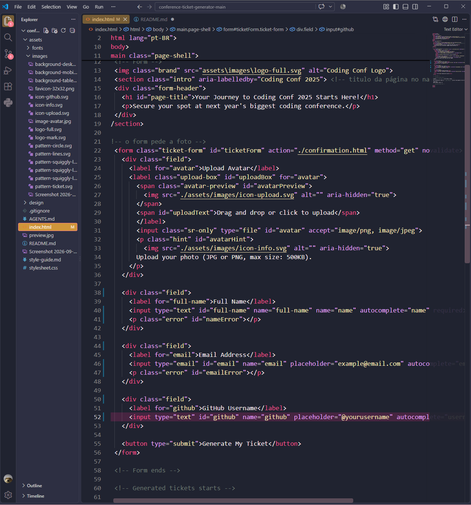
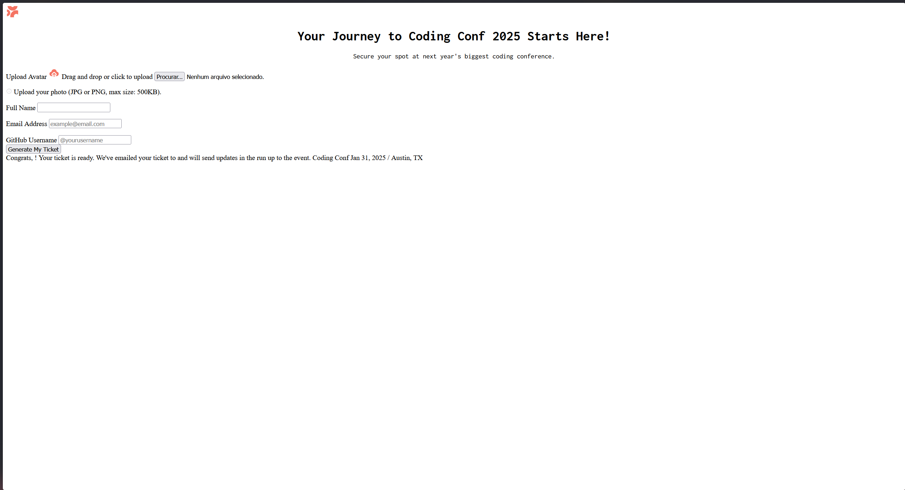
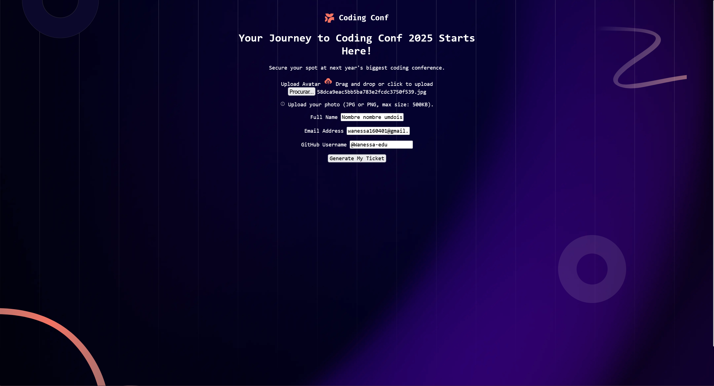
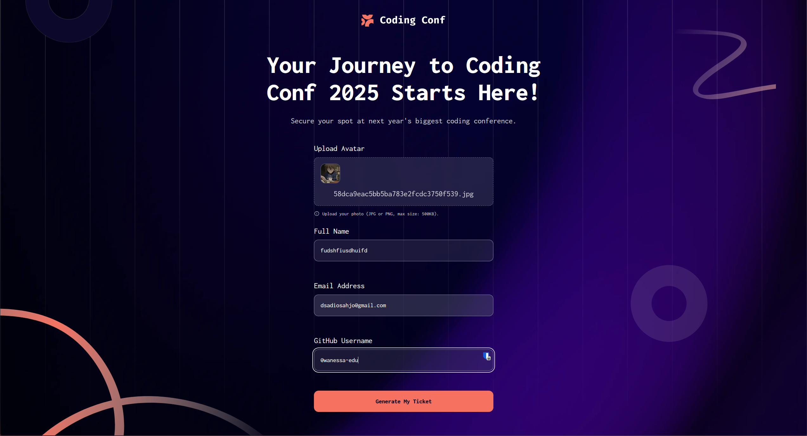
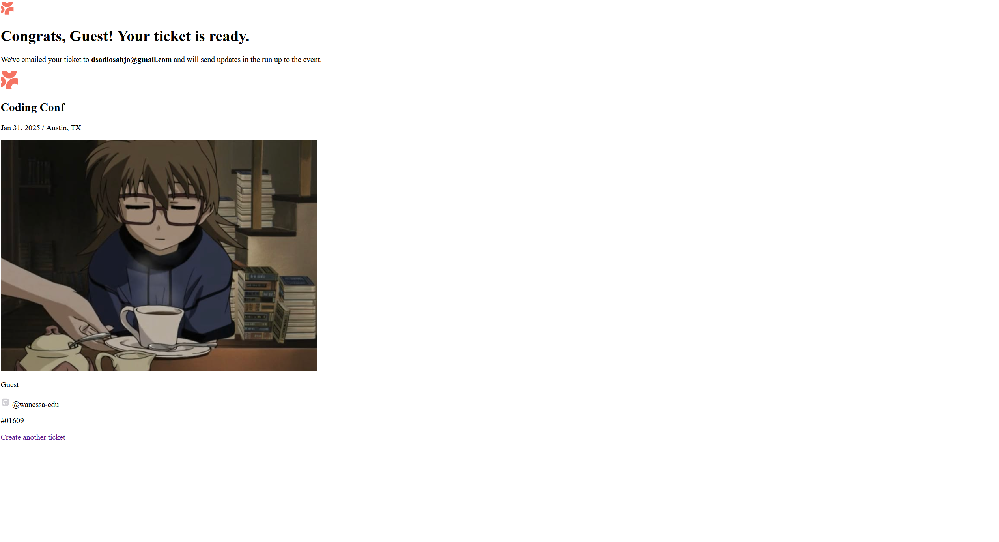
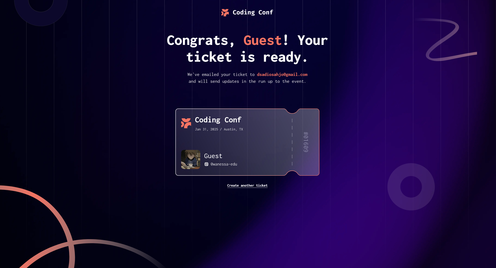

# Conference Ticket Generator
---
## Processo de desenvolvimento
Eu tenho experiência avançada em desenvolvimento web e cheguei a fazer uma grande parte do bootcamp da **Dr. Angela Yu** (*The Complete Full-Stack Web Development Bootcamp*).
Porém, em 2023 o curso passou por uma grande remodelação e acabei perdendo todo o meu progresso (que já passava dos 50%). A frustração na época me fez desanimar e afastar do desenvolvimento web por um tempo.
 porém, com as melhores das minhas habilidades me propus ao desafio e senti um impacto significamente satisfatório nas minhas habilidades já enferrujadas de **HTML, CSS e JavaScript**.
 Sem mais delongas, aqui está o processo de construção do projeto...
---
## Como executar

1. Clone este repositório.
2. Abra a pasta do projeto.
3. Execute o arquivo `index.html` no navegador.

Também é possível usar a extensão Live Server no VS Code.

### 1. Estrutura inicial do HTML

No caso comecei montando o HTML básico.
* **`aria-hidden="true"`**: Utilizado em elementos decorativos (como ícones) para que os leitores de tela os ignorem, evitando poluição sonora para usuários que usam leitores de tela.
* **`aria-label="..."`**: Fornece uma descrição legível para o leitor de tela em elementos visuais que não possuem texto explícito.


### 2. Acessibilidade
**Opção pelo Idioma:** Optei por manter toda a estrutura do site em **Inglês**. Como sou bilíngue, fez sentido manter o conteúdo original do desafio sem alterar o design ou o sentido das frases.


### 3. Organização visual com CSS

Com o HTML pronto, passei para a organização da estrutura e montagem da lógica visual do projeto.

## Desenvolvimento do CSS

Depois de finalizar a estrutura HTML, comecei a estilização da página por partes,
seguindo a organização visual do protótipo.

#### Configuração da fonte

Primeiro, carreguei a fonte Inconsolata utilizando `@font-face`. Assim, a fonte
pôde ser aplicada em toda a página por meio da propriedade `font-family`.

```css
@font-face {
  font-family: "Inconsolata";
  src: url("./assets/fonts/Inconsolata-VariableFont_wdth,wght.ttf") format("truetype");
  font-weight: 400 800;
}
```

Depois, apliquei essa fonte no `body`, garantindo que os textos da página
seguissem a mesma identidade visual.

#### Organização das cores

Criei variáveis dentro de `:root` para guardar as cores utilizadas no projeto.
Separei tons neutros para o fundo, textos e bordas, além de tons alaranjados
para o botão, os destaques e as mensagens de erro. Assim, uma cor pode ser
alterada em um único lugar.

#### Construção do fundo

Utilizei várias imagens na propriedade `background` para combinar a textura
principal com as linhas decorativas do protótipo. Também utilizei os pseudo-
elementos `body::before` e `body::after` para criar círculos decorativos sem
adicionar novos elementos ao HTML.

#### Organização do formulário

A classe `.page-shell` controla a largura máxima, o espaçamento e o alinhamento
geral da página. Já a classe `.ticket-form` limita a largura do formulário e o
mantém centralizado com `margin: 0 auto`.

Nos campos, utilizei bordas arredondadas, fundos semitransparentes e espaçamento
interno para aproximar o resultado visual do protótipo.

#### Estados de interação

Adicionei os estados `:hover`, `:focus` e `:focus-visible` para indicar quando
um campo ou botão está sendo utilizado. O foco também melhora a acessibilidade
para quem navega utilizando o teclado.

Na área de upload, `.is-dragging` altera o fundo quando uma imagem é arrastada
sobre o campo, enquanto `.has-error` modifica a borda dos campos com erro.

#### Tipografia e responsividade

Utilizei `rem` em grande parte dos espaçamentos e tamanhos de fonte. Também
utilizei porcentagens, `vw` e `clamp()` quando era necessário adaptar o layout
ao tamanho da tela.

No título principal, `clamp()` define um tamanho mínimo, um tamanho flexível e
um tamanho máximo:

```css
font-size: clamp(2.6rem, 5vw, 4rem);
```




[](https://youtube.com/LE9mEsbndLg)

Fazendo testes, como não tinha JavaScrypt não tinha retorno do servidor então é apenas um demonstrativo, fiz testes apenas para validação visual do fluxo.


### 4. Ajustes de responsividade e alinhamento


* **Unidades relativas**: Utilizei `rem`, porcentagens, `vw` e `clamp()` de acordo com a necessidade de cada elemento, garantindo uma adaptação melhor a diferentes telas.
* **Centralização**: Utilizei `text-align: center` e alinhamentos de Grid e Flexbox para posicionar o conteúdo conforme o protótipo do desafio.

### 5. Testes visuais
[](https://youtube.com/cv0PwazFVPc)

O projeto já está tomando forma e ficando com o visual certinho!


### 6. Implementação do JavaScript

Depois de finalizar a estrutura visual, comecei a adicionar as interações com
JavaScript. O objetivo foi fazer com que o formulário deixasse de ser apenas
demonstrativo e passasse a responder às ações do usuário.

#### Upload do avatar

Criei uma função para verificar o arquivo escolhido pelo usuário. O sistema
confere se o arquivo é uma imagem JPG ou PNG e se possui no máximo 500 KB.
Quando o arquivo é válido, utilizei `FileReader` para carregá-lo e mostrar uma
prévia dentro do formulário.

Também implementei a possibilidade de arrastar a imagem para a área de upload.
Durante o arraste, a classe `.is-dragging` é adicionada para alterar o visual da
área e indicar que ela está pronta para receber o arquivo.

#### Validação dos campos

Adicionei validações para o nome completo, o endereço de e-mail e o usuário do
GitHub. Quando algum dado está ausente ou incorreto, a classe `.has-error` é
adicionada ao campo e uma mensagem é exibida para orientar o usuário.

No e-mail, utilizei uma expressão regular para verificar se o valor possui um
formato básico de endereço eletrônico.

#### Armazenamento dos dados

Depois que o formulário é validado, os dados são armazenados no
`sessionStorage`. O avatar é convertido em uma URL de dados para que também
possa ser utilizado na página de confirmação.

Escolhi o `sessionStorage` porque os dados precisam permanecer disponíveis
durante a navegação entre o formulário e a página do ingresso, sem serem
mantidos permanentemente no navegador.

### 7. Página de confirmação

Criei o arquivo `confirmation.js` para recuperar os dados enviados pelo
formulário e preencher o ingresso gerado. O script recupera o nome, o e-mail,
o usuário do GitHub e o avatar salvo anteriormente.

Durante os testes, encontrei um erro na página de confirmação: o CSS não estava
sendo aplicado. O problema estava no caminho informado no elemento `<link>` do
HTML. A página referenciava um arquivo chamado `styles.css`, mas o arquivo
existente no projeto era `stylesheet.css`. Como o navegador não encontrava a
folha de estilos, a página era exibida sem a formatação definida no projeto.




Depois de corrigir o caminho para `stylesheet.css`, a página passou a carregar
os estilos corretamente. Em seguida, finalizei a integração com JavaScript,
incluindo a validação do formulário, o upload do avatar e a geração do ingresso
personalizado.



O nome pode ser recebido pela URL através do campo `full-name` ou recuperado do
`sessionStorage`. Essa adaptação foi necessária porque o formulário utiliza
`full-name` como nome do campo, enquanto a primeira versão do script procurava
apenas pelo parâmetro `name`.

Também adicionei uma verificação para garantir que o usuário do GitHub seja
exibido com o símbolo `@` e defini valores padrão para os casos em que algum
dado não esteja disponível.

Por fim, os dados são inseridos nos elementos correspondentes da página de
confirmação, permitindo visualizar o ingresso personalizado depois do envio do
formulário.
